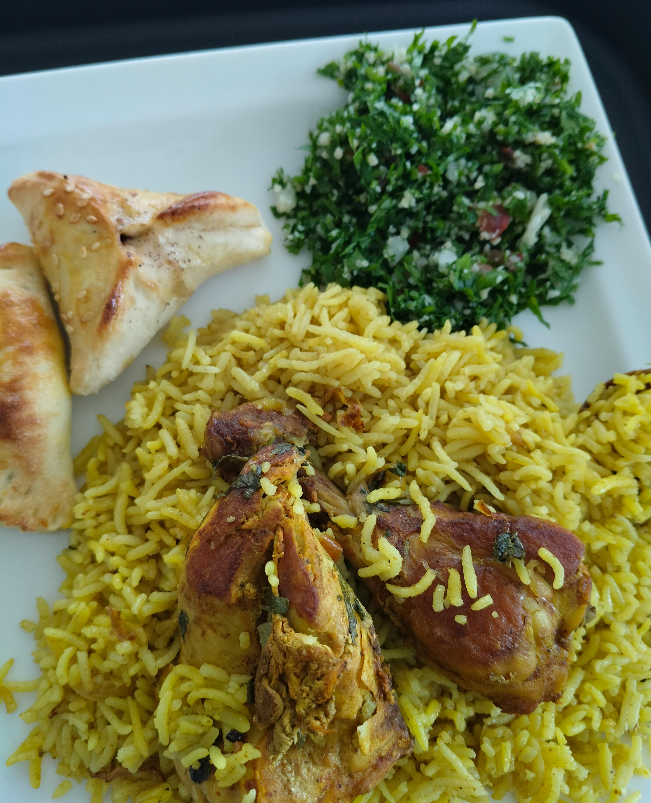

# Traditional Food
## Working Hours
Monday to sunday  
10am to 10pm

<b>The foods we provide and deliver for our respected customers</b>

*Figure 1: Checken Kebab on the fire.*

[Watch the video](https://github.com/toyshop283/toyshop283.gethub.io/raw/main/web2-video1.mp4)

### If you cant see the above video check this youtube link 
<iframe width="560" height="315"
  src="https://www.youtube.com/embed/y_96MSTTrtA"
  title="YouTube video player"
  frameborder="0"
  allow="accelerometer; autoplay; clipboard-write; encrypted-media; gyroscope; picture-in-picture"
  allowfullscreen>
</iframe>

<a href="https://toyshop104.wordpress.com/?_gl=1*1os3wty*_gcl_au*NjQzOTAzMTY4LjE3NTE1MTU1NzQuMTg5Nzc5NDAxNC4xNzUxNTIwNTE4LjE3NTE1MjA3MzU." rel="noopener norefferrer">visit our trusted website also please </a>
